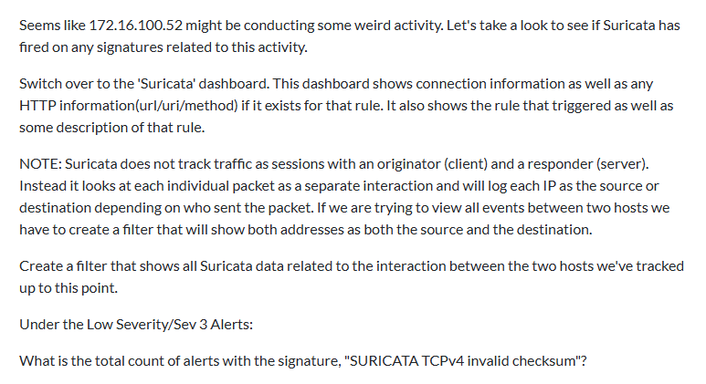
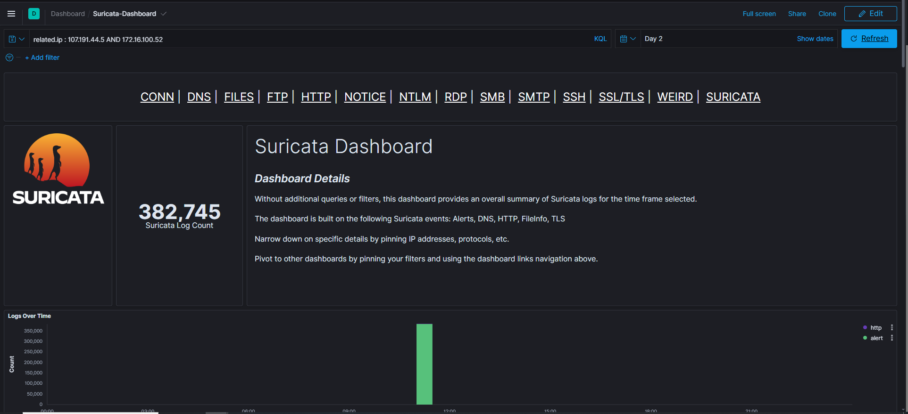
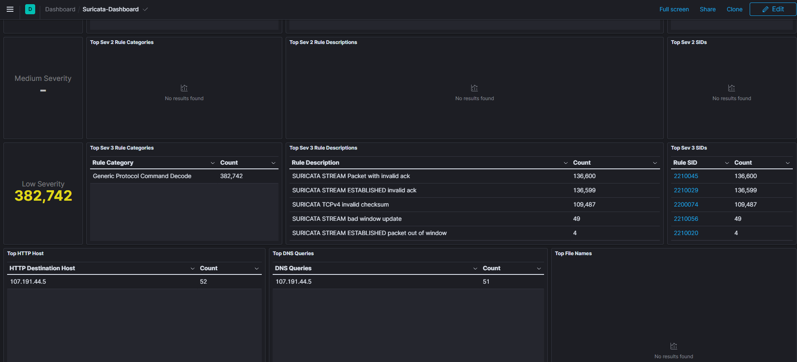
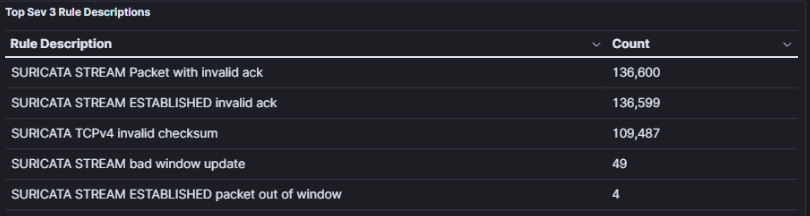

# Suricata IDS Alert Analysis

## Overview

Analyzed large-scale IDS alert dataset to identify signature patterns and validate detection coverage across network traffic. Demonstrated ability to work with high-volume security telemetry and correlate alerts between specific hosts.

## Scenario

Investigated Suricata IDS alerts to identify the frequency of specific signature patterns between two network hosts. This analysis demonstrates understanding of alert severity classification, signature behavior, and large-scale alert correlation.

**Challenge Question:** What is the total count of alerts with the signature "SURICATA TCPv4 invalid checksum"?

**Answer:** 109,487 alerts

## Tools Used

- **Suricata** - Network IDS/IPS
- **Elastic SIEM** - Alert aggregation and analysis platform
- **KQL** - Query language for filtering and correlation

## Analysis Process

### 1. Traffic Filtering
Applied `related.ip` filter to isolate events:
```
related.ip: (107.191.44.5 OR 172.16.100.52)
```

**Purpose:** Narrow analysis to communication between two specific hosts

### 2. Severity Classification
Navigated to Low Severity (Sev 3) Alerts panel in Suricata dashboard

**Why this matters:**
- Suricata classifies alerts by severity (1=High, 2=Medium, 3=Low)
- Invalid checksum alerts typically classified as low severity
- Understanding severity helps prioritize analyst attention

### 3. Signature Identification
Located signature: **"SURICATA TCPv4 invalid checksum"**

**Alert count:** 109,487

### 4. Pattern Analysis
Reviewed alert distribution and patterns:
- High volume indicates potential network issues or attack activity
- Invalid checksums can indicate packet manipulation or network problems
- Correlation with specific hosts provides investigation context

## Key Findings

**Signature:** SURICATA TCPv4 invalid checksum  
**Alert Count:** 109,487  
**Severity:** Low (Sev 3)  
**Hosts Analyzed:** 107.191.44.5 ↔ 172.16.100.52  
**Platform:** Elastic SIEM + Suricata

## Technical Skills Demonstrated

✅ Large-scale alert analysis (100K+ events)  
✅ IDS signature pattern recognition  
✅ Alert severity classification understanding  
✅ Traffic correlation using `related.ip` filters  
✅ Elastic SIEM navigation and querying  
✅ High-volume security telemetry analysis  
✅ Alert prioritization methodology  

## Understanding Invalid Checksum Alerts

**What it means:**
- TCP packets with invalid checksums detected
- Could indicate network issues, packet corruption, or manipulation
- Common in certain network configurations or attack scenarios

**Why it matters for security:**
- Can indicate packet injection attempts
- May signal man-in-the-middle activity
- Could be legitimate network behavior requiring tuning
- High volume requires investigation to determine root cause

**Analysis considerations:**
- 109K alerts is extremely high volume
- Requires tuning to reduce noise
- May indicate legitimate traffic pattern needing exclusion
- Or could signal malicious activity worth investigating

## IDS Analysis Best Practices

**Effective Alert Analysis:**
✅ Filter by host relationships to reduce noise  
✅ Understand severity classifications  
✅ Review signature descriptions for context  
✅ Correlate high-volume alerts with other indicators  
✅ Distinguish between tuning needs and real threats  

**Alert Triage Process:**
1. Filter to relevant hosts/timeframes
2. Review alert counts and patterns
3. Assess severity levels
4. Investigate anomalies
5. Determine if tuning needed

## Alert Volume Management

**Challenge:** 109,487 alerts from single signature = alert fatigue

**Solutions:**
- **Tuning:** Adjust thresholds for known benign traffic
- **Whitelisting:** Exclude legitimate traffic patterns
- **Aggregation:** Group alerts to reduce noise
- **Correlation:** Combine with other indicators before escalating
- **Baseline:** Understand normal vs. anomalous volume

## Operational Context

**Why This Analysis Matters:**
- High-volume alerts require tuning strategy
- Pattern analysis helps distinguish signal from noise
- Understanding severity helps prioritize analyst time
- Host-based filtering accelerates investigation

**Actionable Outcomes:**
- Document baseline alert volume
- Determine if traffic between these hosts is legitimate
- Decide if signature tuning needed
- Create alert suppression rules if appropriate

## Lessons Learned

- **related.ip filter is powerful** - Fastest way to isolate host-to-host events
- **Severity levels guide prioritization** - Not all alerts require immediate action
- **High volume ≠ high priority** - Context determines response
- **Dashboard navigation matters** - Knowing where to find data accelerates analysis
- **Signature understanding is critical** - Read descriptions to understand what fired

## Suricata Dashboard Navigation

**Key Panels for Alert Analysis:**
- **Top Signatures** - Most frequent alerts
- **Severity Distribution** - High/Medium/Low breakdown
- **Alert Timeline** - Temporal patterns
- **Source/Destination Analysis** - Host relationships
- **Signature Descriptions** - What each rule detects

---

## Analysis Screenshots

### Lab Challenge Question


*Challenge: Identify the total count of alerts with signature "SURICATA TCPv4 invalid checksum"*

### Host Traffic Filtering


*Filtering Suricata logs using related.ip query to isolate traffic between 107.191.44.5 and 172.16.100.52*

### Alert Severity Panel


*Low Severity (Sev 3) alerts panel showing triggered Suricata signatures and alert counts*

### Alert Count Analysis


*Final count: 109,487 alerts for SURICATA TCPv4 invalid checksum signature*

**Analysis Date:** 2025 (Lab Environment)  
**Platform:** Suricata IDS + Elastic SIEM  
**Alert Volume:** 109,487 alerts analyzed  
**Analyst:** Paige Alfred
